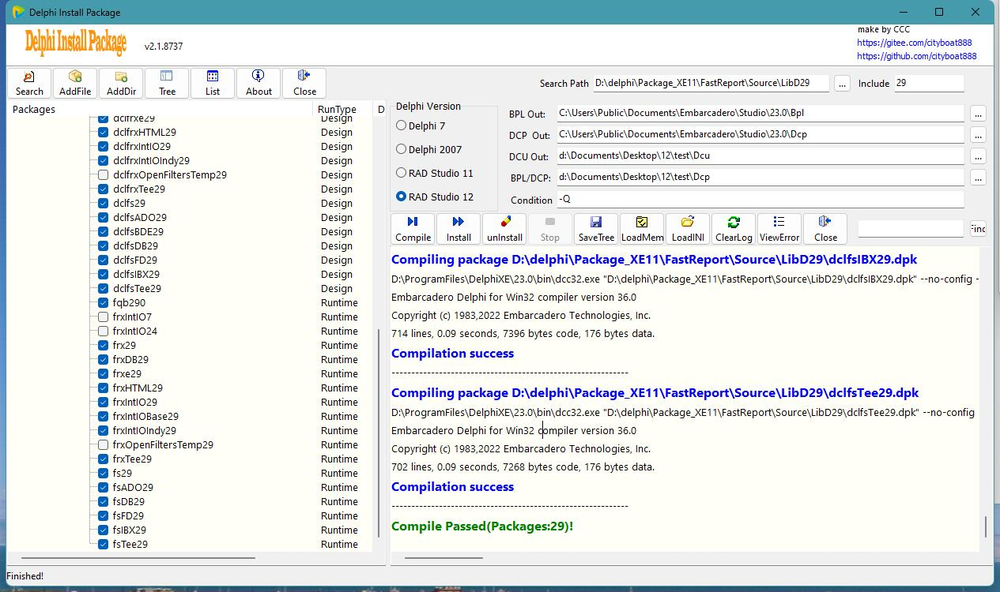
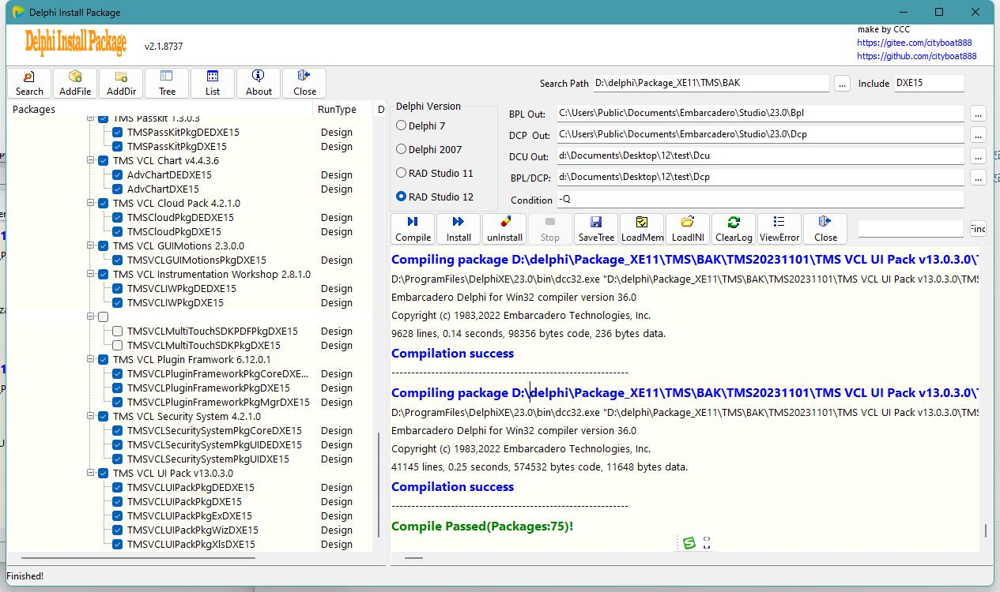
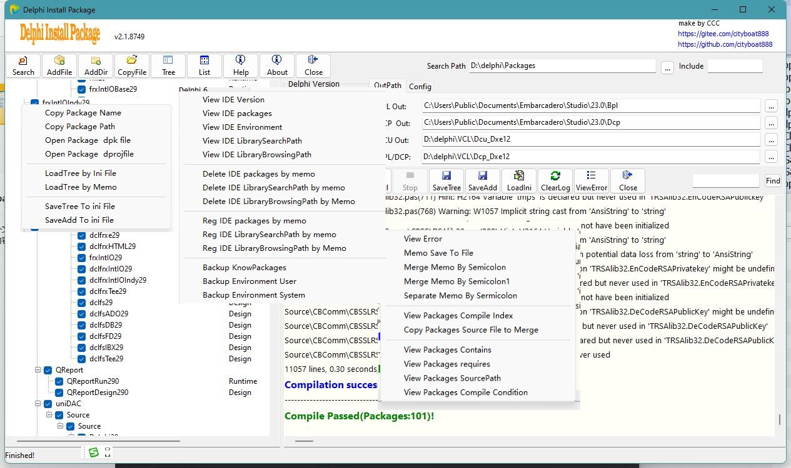

# DelphiInstallPackage

#### 介绍

永久免费使用,不开源

delphi package install

操作提示:

------------------------------------------
1.归集目录BPL/DCP支持多个,用分号(;)分隔,首字母^表示不复制dcp
  例:D:\delphi\VCL\;^D:\delphi\VCL\bin;D:\delphi\VCL\VCL_DCP
   D:\delphi\VCL\        -->复制bpl和dcp
  ^D:\delphi\VCL\bin    -->只复制bpl   
   D:\delphi\VCL\VCL_DCP -->复制bpl和dcp
2.部份Dev支持,如D6/D7版dev表格控件
3.支持tms/fr/unidac等复杂组件
4.对于比较复杂的组件,如果编译失败,
  如dev/fr/unidac等可先【CopyFile】源代码归集后再安装  
5.支持加载ini文件，加载memo
6.支持保存选中package到ini文件，单个/多个追加保存ini文件
7.支持单从此/多个添加，或按目录搜索
8.可按memo单行/多行增加/删除package/librarySearchPath/libraryBrosingPath
9.include搜索文件名，
	空白代表*.dpk; 
	例：*280.dpk只输入：280
10.目录和include支持回车查询,

----------button menu 1-------------------

【Search】:加载指定目录下包含指定字符串(例:*AAA*)的dpk文件

【AddFile】:从批定位置一次添加一个dpk控件包

【AddDir】:从指定位置批量添加dpk控件包

【Tree】:树型按目录显示控件包

【List】:按列表只显示控件包名称

【Help】:显示帮助

【About】:显示关于

【Close】:关闭

-----------button menu 2------------------

【Compile】:只编译控件

【Install】:编译并安装控件

【unInstall】:从注册表卸载bpl控件

【Stop】:停止

【SaveTree】:保存左则树中选中的控件到ini文件

【LoadMem】:从memo加载dpk列表

【LoadINI】:从ini文件加载dpk列表

【ClearLog】:清除下表中的所有日志

【ViewError】:查看编译错误信息

【Close】:关闭

更新说明
------------------------------------------
Version 2.1.8751
归集目录BPL/DCP支持多个,用分号(;)分隔,首字母^表示不复制dcp
例:D:\delphi\VCL\;^D:\delphi\VCL\bin;D:\delphi\VCL\VCL_DCP
D:\delphi\VCL\        -->复制bpl和dcp
^D:\delphi\VCL\bin    -->只复制bpl   
D:\delphi\VCL\VCL_DCP -->复制bpl和dcp
 
Version 2.1.8749
1.新增 IDE 菜单
2.新增 memo 菜单
3.新增 tree 菜单
 
Version 2.1.8745
1.新增按钮 SaveAdd,保存左则树中选中的控件追加到ini文件
2.新增配置:MSbuild,默认不使用MSbuild,因dproj中的DCC_UsePackage经常异常
3.新增配置:MustHave,默认选中:查询结果文件名必须包含
4.新增配置:AddLibBrows,
5.新增配置:AddLibSearch
7.新增三个IDE删除右键菜单:packagse,librarySerachpath/ibraryBrowsingpath
8.新增三个IDE注册右键菜单:packagse,librarySerachpath/ibraryBrowsingpath

 
Version 2.x 2023
1.new designed 
2.new IDE PopupMenu
3.new memo PopupMenu
4.new tree PopupMenu
5.compile Condition
6.save/load ini file 
7.save/load memo 
8.add file/files 
9.View Errors 
 
Version 1.x 2015
